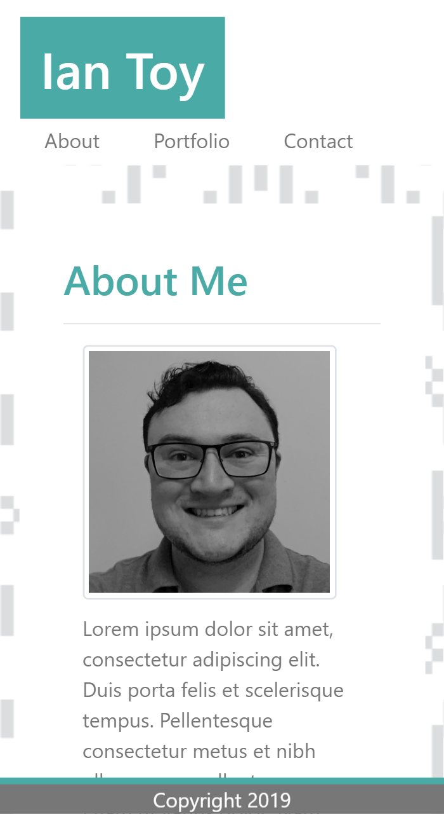
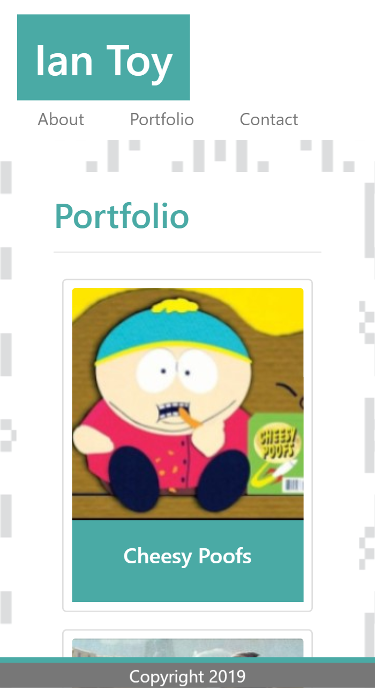
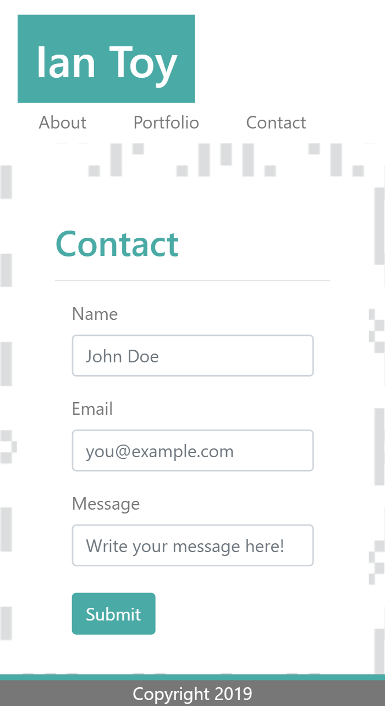
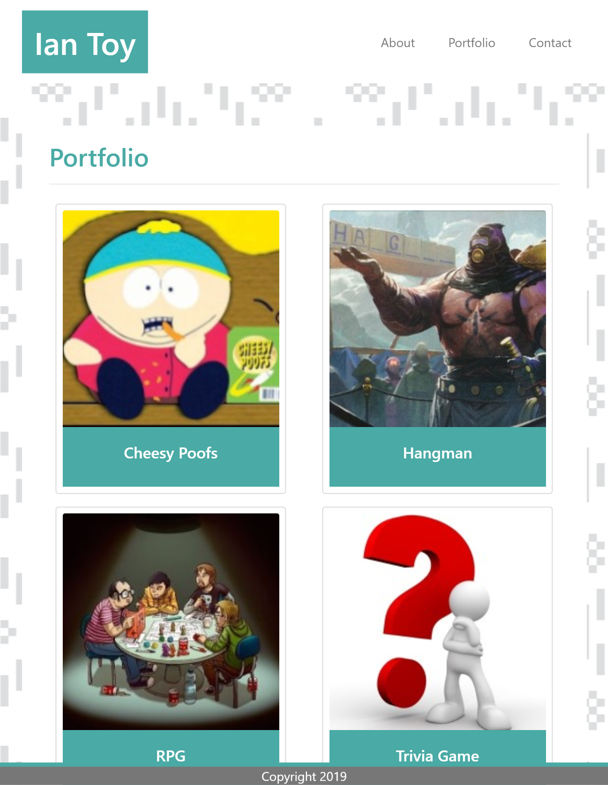
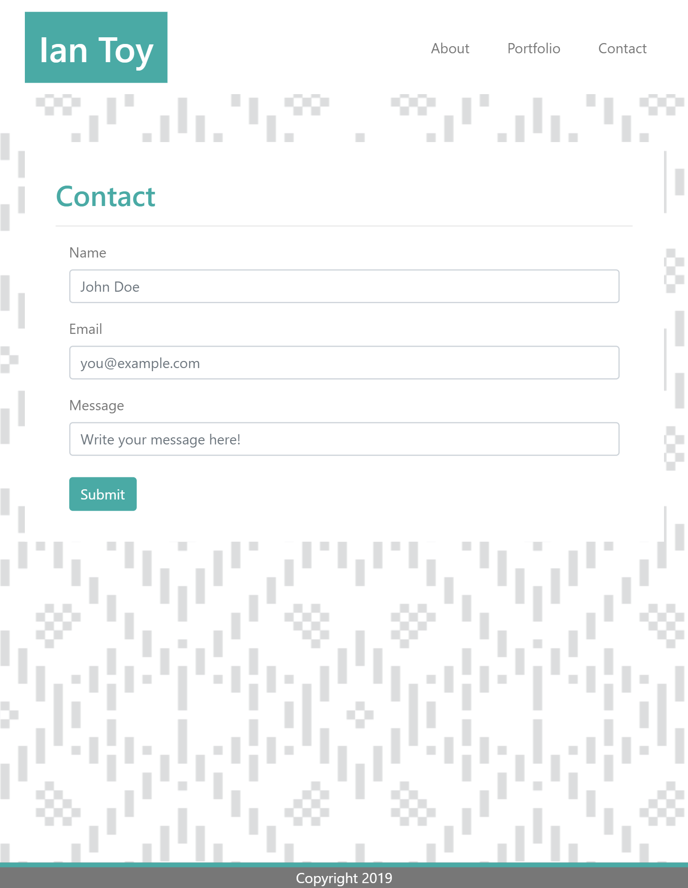
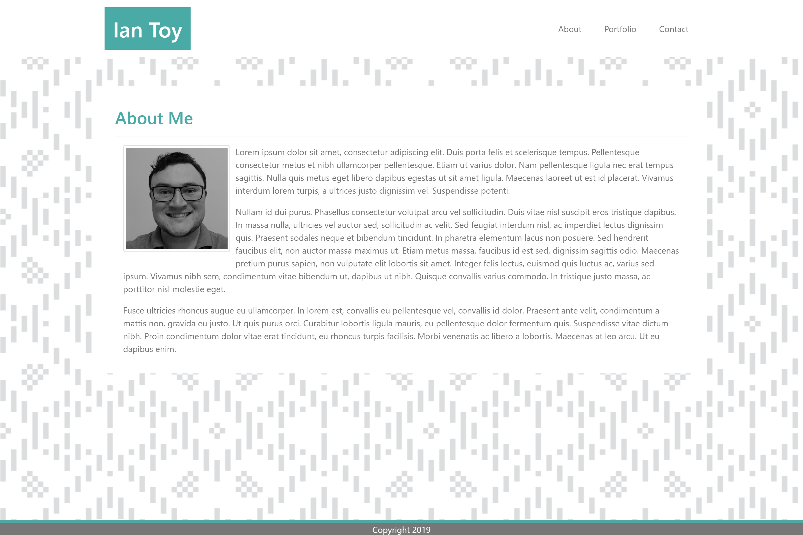
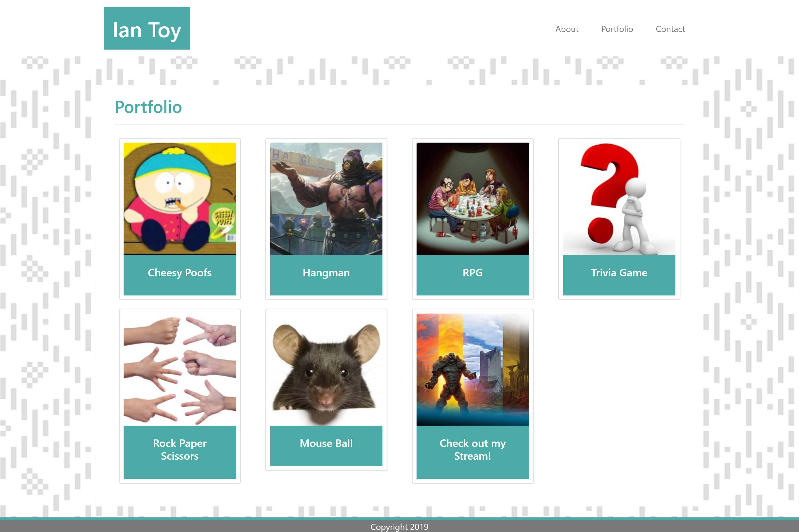
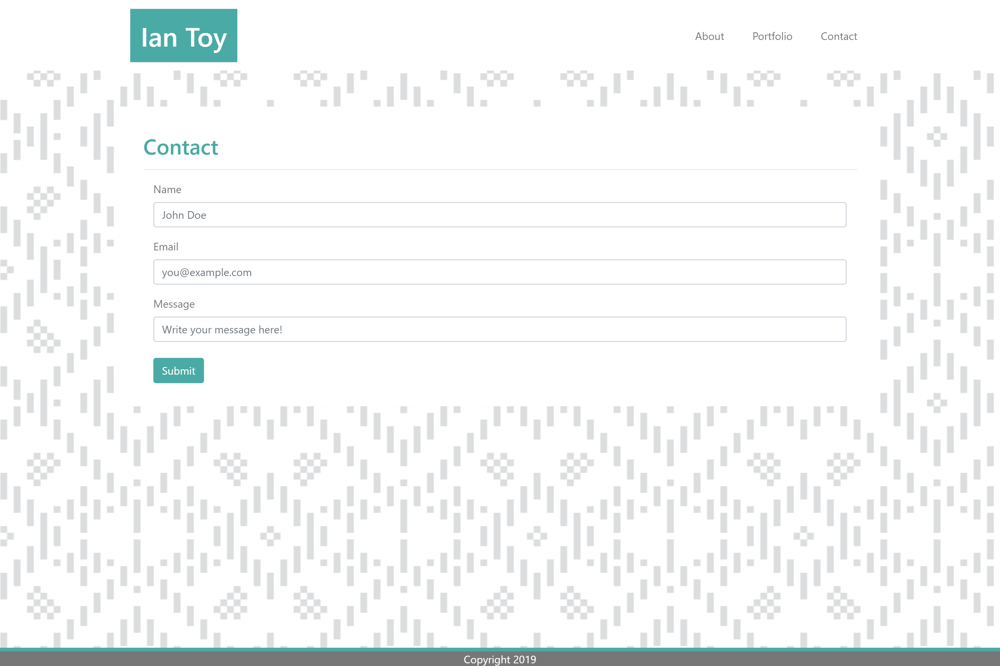

# bootstrap-portfolio
Homework 2, a responsive portfolio developed using bootstrap

# My Web Development Portfolio

This site serves as a basic portfolio for my web development projects. 

## Portfolio Contents

### About Me
This page has my basic personal information, including my education, work history, and customer reviews.

### Portfolio
Here you can find my completed projects and works in progress. Works in progress are marked by the red background text. Completed project names are in blue.

### Contact
If you like what you see, please send me an email with any questions you may have about contracting your very own website. I would love to hear from you!

## Built With:

* [HTML] This comprises much of the DOM.
* [CSS] This affects the styling of each page.
* [Javascript] This makes the pages interactive and responsive.
* [Bootstrap] For this project, I leveraged several Bootstrap components. You can learn more about Boostrap [here](https://getbootstrap.com/)

## Under the Hood
Below are a few code snippets illustrating techniques I used to create the portfolio page.

### Snippet 1: HTML div container etc.
    

                

                        <h2>
                                <strong>
                                Portfolio
                                </strong>
                        </h2>
                                

Above is the code used to define the container of the content on the portfolio page. The classes container, wrapper, and content margin establish the presentation of the content within the white background above the folk-art backdrop.

### Snippet 2: HTML Anchor Tags Displayed as Tiles

    

        <a class="left" href="https://scratch.mit.edu/projects/341915412/" target="_blank">
           
              

              Cheesy Poofs
              

        </a>
    

Here is an example of one of the eight anchor tags used to creat the tile links. Each element floats left, is linked to a project, and opens in another tab when clicked. The classes img.tile and div.tile define the shape, dimensions, border, and text banner of each of the tiles. These css elements can also be seen in the next code snippet.

### Snippet 3: CSS Classes Used to Create the Portfolio Tiles

    img.tile {
        height: 200px;
        width: 200px;
        border: 2px solid #dddddd;
        margin: 10px;
        position: relative;
    }

    div.tile {
        background: #4aaaa5;
        width: 200px;
       padding: 10px 0px;
        color: #ffffff;
       text-align: center;
       left: 12px;
      position: relative;
      bottom: 80px;
    }

    .contentmargin::after {
       content: "";
       clear: both;
      display: table;
    }

This snippet shows the full list of properties and values used to define the classes that created the linked tiles. The img.tile class gives the dimensions of the image, while the div.tile class styles the text banner that rests at the bottom of the image.

Because all of the images use the float:left positioning, a clearfix hack has been applied to the lowest parent element class, contentmargin. This allows the white background to extend low enough to include all of the link tiles.

## Page Responsiveness

The use of Bootstrap components contributes to the dynamic responsiveness of each page when viewed at different sizes. Below are a few screenshots of how my portfolio behaves at diferent window sizes.

### Small
#### Index

#### Portfolio

#### Contact

### Medium
#### Index

#### Portfolio

#### Contact

### Large
#### Index

#### Portfolio

#### Contact

## Deployed Link

Below is a link to the live site.
* [See Live Site](https://ietoy.github.io/bootstrap-portfolio/)

## Authors
Ian Toy

## Acknowledgements
Thanks to my instructor Jerome, teaching assistants Kerwin and Mahisha, and my classmates Andres, Dexter, Sam, Fanuel, Rachel, Mike, and Chris for their help in making this website a reality!